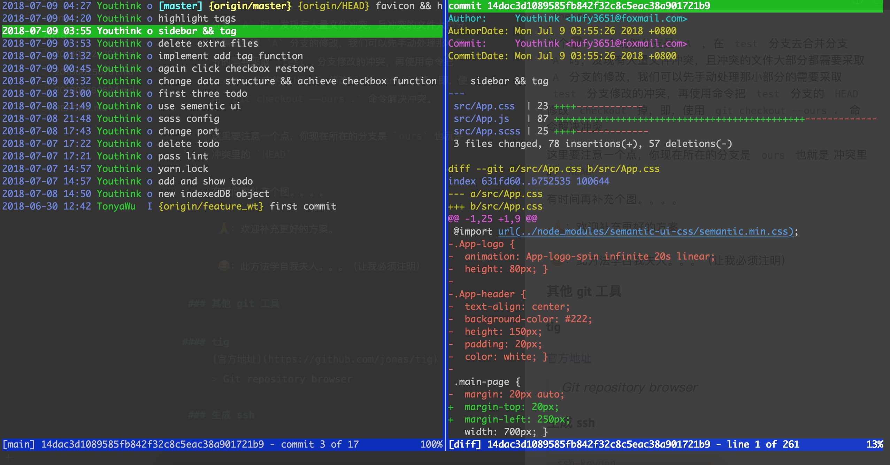



`git` 的几个概念：

- Workspace：工作区
- Index / Stage：暂存区
- Repository：仓库区（或本地仓库）
- Remote：远程仓库

> 下面的 git 

注：简写指的是 `zsh` 自带的 `git` 扩展

## 常用命令

克隆仓库

```bash
git clone https://github.com/Youthink

简写 gcl
```

添加修改

```bash
git add --all

简写 gaa
```

指定某个文件的修改添加到下次提交

```bash
git add -p <file>
```

提交修改

```bash
git commit -m

简写 gcmsg
```

代码推到远程仓库

```bash
git push origin 当前分支

简写 ggpush
```

查看已经commit的具体细节、文件更改

```bash
git log -p
```

暂存代码

```bash
git stash save

简写 gsta

git stash save some_msg   这样就好区分了
```

查看之前暂存的代码号

```bash
git stash list

简写 gstl
```

查看之前暂存的代码内容

```bash
git stash show --text

简写 gsts
```

恢复暂存的代码

```bash
git stash apply stash@{1}   1 是恢复第一个

简写 gstaa
```

清除所有暂存的代码

```bash
git stash clear

简写 gstc
```

删除某一条暂存代码

```bash
git stash drop stash@{0}

```

恢复第一条缓存代码并删除记录

```shell
git stash pop
```

### 代码回滚

放弃工作目录下的所有更改

```bash
git reset --hard HEAD
```

只取消提交

```bash
git reset --soft
```

想直接丢弃工作区的修改

```bash
git checkout -- file
```

用一个新提交来消除一个历史提交所做的任何修改

```bash
git revert c011eb3

# 这个命令只回滚某一次，不是某一次到现在的代码。
```

回滚到之前某一次提交

比如我们有 1、2、3、4、5、6、7、8 次提交，现在因为某些不可描述的原因，我们想把代码恢复到 4 这次提交。

```bash
git reset --hard 4这次提交的 hash 串
git reset --soft 8这次提交的 hash 串
git commit -m 'Reverted 5 6 7 8' 
```

放弃本地修改同远程同步

```bash
git reset --hard origin/master
```

回退到某个版本

```bash
git reset --hard c011eb3

简写 grhh
```

已经 add 了怎么取消

```bash
git reset HEAD 文件
```

已经commit了怎么取消（最近一次）

```bash
git commit --amend
```

修改上次的提交者信息

```bash
git commit --amend --reset-author
```

### 分支

切换到上一个分支

```bash
gco -
```

新建并切换到分支

```bash
git checkout -b 分支名

简写 gcb 分支名
```


拉取远程所有分支的更改
(同时可以清除本地无效的远程分支)

```bash
git fetch -p
```

下载远程端的所有改动到本地，不会自动合并到当前

```bash
git fetch

简写 gf
```

删除本地分支

```bash
git branch -d  分支名

git branch -D  分支名

简写 gbd
```

删除远程分支

```bash
git push origin :分支名
```

重命名本地分支

```bash
git branch -m
```

### 标签

查看标签

```bash
git tag
```
删除本地标签

```bash
git tag -d 标签名
```
删除远程标签

```bash
git push origin :refs/tags/标签名
```

推送标签

```bash
 git push origin 标签名
```

打标签

```bash
git tag -a 标签名 -m "提交信息"
```

### 其他

#### 如果修改 git 已提交的用户邮箱和用户名
[请看这篇文章](https://hufangyun.com/2018/git-change-user-info)
#### 如果分目录配置用户信息
[请看这篇文章](https://hufangyun.com/2018/git-change-user-info)
#### 合并某一次提交的内容

```bash
git cherry-pick commit哈希值
```

#### 查看某个文件的任意一行是谁？在什么时间修改的？

```bash
git blame 文件路径
```

#### merge 的时候如何快速解决大量文件的冲突？

如果合并时有大量文件冲突，可以使用命令

```bash
git checkout --ours( --theirs)  文件
```

冲突文件中 `HEAD` 区块是 `ours` ，汇入的分支区块是 `theirs` 。

举个🌰：一个功能分支是 `A` ，在 `test` 分支去合并分支 `A` 时，发现有大量文件冲突，且冲突的文件大部分都需要采取 `A` 分支的修改，我们可以先手动处理那小部分的需要采取 `test` 分支修改的冲突，再使用命令把 `test` 分支的 `HEAD` 修改 `checkout` 掉，即，使用 `git checkout --ours .` 命令解决冲突。

这里要注意一个点，你现在所在的分支是 `ours` 也就是 冲突里的 `HEAD`

有时间再补充个图。。。。

 🙏：欢迎补充更好的方案。
 
 😂：此方法学自我夫人。。。（让我必须注明）
 
### 同时部署到多个 git 源
比如同时更新到 `Github` 和 `Coding`
- 在已有的本地仓库内找到隐藏的 `.git` 文件夹
- 打开里面的 `config` 文件
- 添加如下设置：两个远端仓库的 `url`，并命名为 `origin`

```bash
[remote "origin"]
    url = git@git.coding.net:user_name/user_name.coding.me.git
    url = git@github.com:user_name/user_name.github.io.git
```

### 其他 git 工具

#### tig
[官方地址](https://github.com/jonas/tig)
> Git repository browser
> 方便的查找每次的更改记录

上张图片感受一下




### 生成 ssh

```
ssh-keygen

cat ~/.ssh/id_rsa.pub
```


